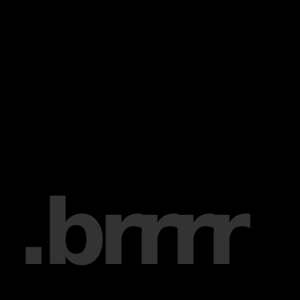

<div id="top"></div>

[](https://www.npmjs.com/package/b4r)
[](https://bundlephobia.com/package/b4r)
[](https://github.com/ofrbg/b4r/blob/main/LICENSE)

<br />
<div align="center">
  <a href="https://github.com/OFRBG/b4r">
    
  </a>
  <h3 align="center"></h3>

  <p align="center">
    config files go brrrr
    <br />
    <a href="https://github.com/OFRBG/b4r/issues">Report Bug</a>
    ·
    <a href="https://github.com/OFRBG/b4r/issues">Request Feature</a>
  </p>
</div>

## About The Project

<blockquote>
  ⚠️ This project is as stable as an inverted two-link pendulum.
</blockquote>

<p align="right">(<a href="#top">back to top</a>)</p>

### Package Details

- [npm](https://www.npmjs.com/package/b4r)
- [Bundlephobia](https://bundlephobia.com/package/b4r)

<p align="right">(<a href="#top">back to top</a>)</p>

## Getting Started

```ts

```

### Installation

```sh
pnpm add -D b4r
```

<p align="right">(<a href="#top">back to top</a>)</p>

## Basic Usage
